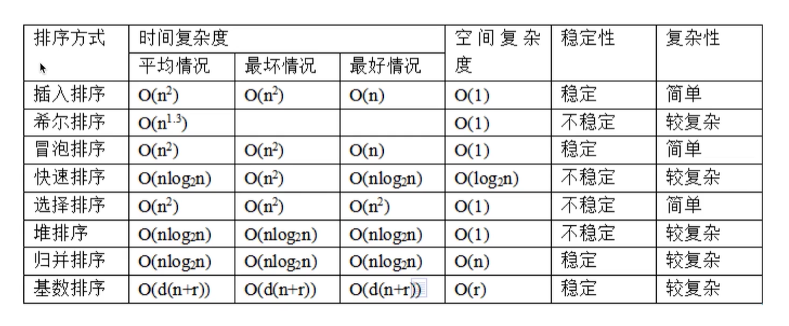

- 排序链表
- 环形链表

  

## 1、模拟链表

```javascript
// 声明链表的节点

class Node {
  constructor(value) {
    this.val = value;
    this.next = undefined;
  }
}

// 声明链表的数据结构

class NodeList {
  constructor(arr) {
    // 声明链表的头部节点
    let head = new Node(arr.shift());
    let next = head;
    arr.forEach((item) => {
      next.next = new Node(item);
      next = next.next;
    });
    return head;
  }
}
```

## 2、使用快速排序排序单链表

```javascript
// 交换两个节点的值
let swap = (p, q) => {
  let val = p.val;
  p.val = q.val;
  q.val = val;
};

// 寻找基准元素的节点
let partion = (begin, end) => {
  let val = begin.val;
  let p = begin;
  let q = begin.next;
  while (q !== end) {
    if (q.val < val) {
      p = p.next;
      swap(p, q);
    }
    q = q.next;
  }
  // 让基准元素跑到中间去
  swap(p, begin);
  return p;
};

export default function sort(begin, end) {
  if (begin !== end) {
    let part = partion(begin, end);
    sort(begin, part);
    sort(part.next, end);
  }
}
```

## 3、环形链表

```javascript
export default function isCircle(head) {
  // 慢指针
  let slow = head;
  // 快指针
  let fast = head.next;
  while (1) {
    if (!fast || !fast.next) {
      return false;
    } else if (fast === slow || fast.next === slow) {
      return true;
    } else {
      slow = slow.next;
      fast = fast.next.next;
    }
  }
}
```
